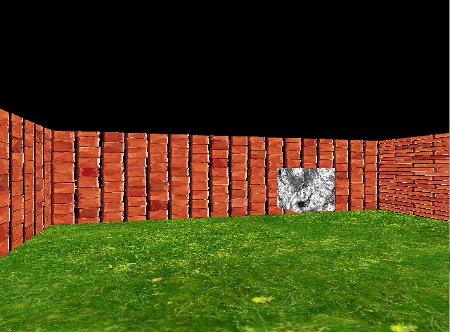

# HMIN317-Projet

## Projet Moteur de Jeux

Moteur fait sous QtCreator avec la librairie OpenGl pour l'ue HMIN317 "Moteur de Jeux" du Master Imagina

- Entity Component

- Gestion des collisions entre les divers objets
 
- Textures et Shaders

- Personnage jouable (deplacement et interaction)

---
### Compilation

Ouvrir gameengine.pro avec le logiciel Qt Creator

---
### Demo

